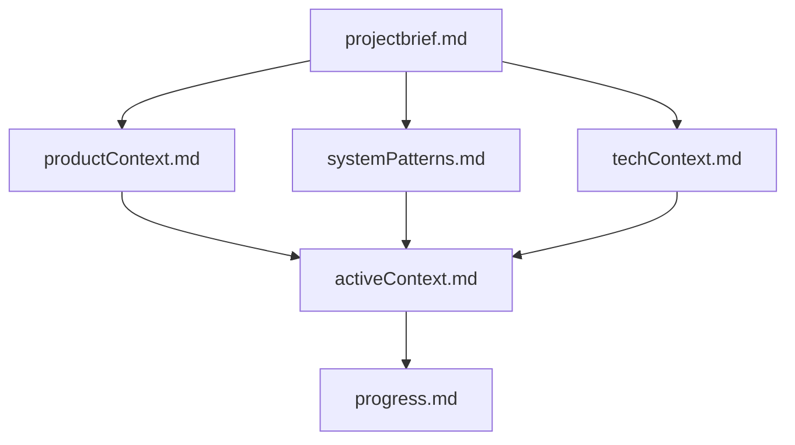
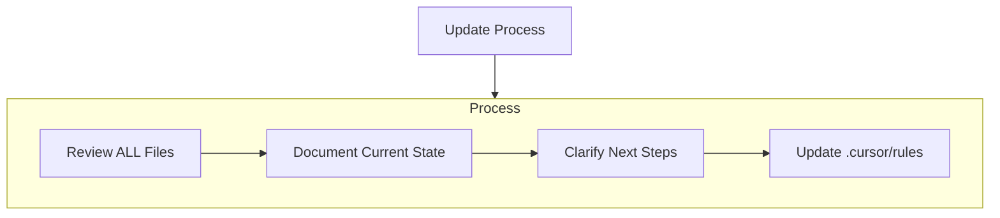

# synctax

Universal Sync for the Agentic Developer Stack.

`synctax` is a cross-platform CLI tool that synchronizes the full agentic developer configuration—MCP servers, agents, skills, memory files, permissions, model preferences, and prompts—across every AI-powered IDE and CLI client on your machine.

---

## 🚀 Features (v1.5)

- **Universal Support**: Native adapters for Claude Code, Cursor, OpenCode, Antigravity, Cline, Github Copilot, Github Copilot CLI, Gemini CLI, and Zed.
- **Watch Daemon (`synctax watch`)**: Run `synctax` silently in the background! Any changes detected in your `~/.synctax/config.json` are instantly pushed to all your installed clients safely.
- **Intelligence Dashboard (`synctax info`)**: A gorgeous tabular interface displaying exactly which AI clients are installed and what resources (MCPs, Agents, Skills) they currently possess.
- **Themed Initialization (`synctax init --theme <theme>`)**: Start off right with our DOS Rebel ASCII art. Supports dynamic hex color palettes (`default`, `cyber`, `rebel`).
- **Advanced File Parsing**: We don't just stop at `.md` files. Adapters fluidly pick up `.agent` and `.claude` extensions seamlessly.
- **Merge-Conservative Security**: Automatically ensures your network and file path deny-lists override permissive rules when pulling team configurations.

## 🛠️ CLI Commands

| Command | Description |
|---|---|
| `synctax init [--theme cyber\|rebel]` | Scaffolds the master config, scans the system for installed clients, and prints the branded banner. |
| `synctax info` | Displays a styled CLI table outlining your AI ecosystem's active capabilities. |
| `synctax watch` | Spawns a local `chokidar` daemon that listens to your master config and syncs upon saves. |
| `synctax sync` | Manually push the master configuration down to all your clients. |
| `synctax pull --from <client>` | Invert the flow: rip a client's specific JSON configuration back into the master state. |
| `synctax memory-sync` | Mirrors context files (`CLAUDE.md`, `.cursorrules`, `AGENTS.md`) across your current working directory. |
| `synctax profile publish <name>` | Securely export your setup (API keys and credentials are automatically stripped!). |

---

## Memory Bank Structure

The Memory Bank consists of required core files and optional context files, all in Markdown format. Files build upon each other in a clear hierarchy inside `docs/memory-bank/`:

### Core Files (Required)
1. `projectbrief.md` - Foundation document that shapes all other files
2. `productContext.md` - Why this project exists and problems it solves
3. `activeContext.md` - Current work focus and next steps
4. `systemPatterns.md` - System architecture and Test-Driven patterns
5. `techContext.md` - Technologies used (Bun, Vitest, Chokidar, cli-table3)
6. `progress.md` - What works and what is left to build

## Documentation Updates

Memory Bank updates occur when:
1. Discovering new project patterns (e.g. `chokidar` ESM module resolutions)
2. After implementing significant feature batches
3. When user requests with **update memory bank** (MUST review ALL files)
4. When context needs clarification

Note: When triggered by **update memory bank**, I MUST review every memory bank file, even if some don't require updates. Focus particularly on activeContext.md and progress.md as they track current state.

## Project Intelligence (.cursor/rules)

The `.cursor/rules` file is my learning journal for each project. It captures important patterns, preferences, and project intelligence that help me work more effectively.

### What to Capture
- Strict usage of RED-Green Test-Driven Development (TDD).
- Environment mock safeguards (`process.cwd` vs `SYNCTAX_HOME`).
- Tool usage patterns and syntax expectations.
